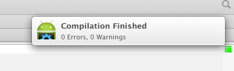
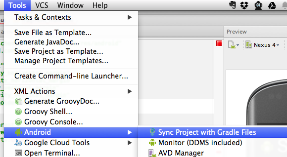

## Using ShinobiCharts with Android Studio

### Introduction

Android Studio is a development environment from Google, which will eventually
replace the eclipse ADT in terms of the recommended tool for creating android
apps. It's currently available as an early access preview on
[developer.android.com](http://developer.android.com/sdk/installing/studio.html),
and is being improved on a daily basis. Therefore it is probably not recommended
for production code, but for those of us who consider themselves early-adopters
it's fun to use it immediately. Naturally you'll want to use ShinobiCharts for
Android in Android Studio, and when you try it you'll notice that it isn't
currently as simple as you might hope. This is partially because of the new
gradle-based build system not yet being able to cope with libraries which contain
a binary component.

This blog post will explain how to get ShinobiCharts for Android working from
within Android Studio, including creating a really simple demo pie chart.

> __Please note:__ Android Studio is changing on very regular basis. These
> instructions are not expected to work indefinitely. Once Android Studio is
> officially released then ShinobiCharts for Android will be updated so that it
> works seamlessly.

### Create a project

Create a new project in Android Studio, setting the name and other details appropriately:

The remaining settings in the new project wizard can be left as default.

### Adding a gradle build file

Eventually it will be possible to use the IDE to add a module dependency, but this
area is currently under heavy development. Therefore instructions would need to
change regularly. Instead, you're going to configure the underlying gradle build
system, and then get the IDE to update itself from these settings.
To do this you need to create a file which described the build process
for the library module, and then specify that the build should build both projects.

First right click on the `shinobicharts-android-library` in the project navigator,
and select `New > File`:

The `build.gradle` file describes how the project should be built, including any
dependencies. Edit the file and enter the following:

    buildscript {
        repositories {
            mavenCentral()
        }
        dependencies {
            classpath 'com.android.tools.build:gradle:0.6.+'
        }
    }

    apply plugin: 'android-library'

    android {
        compileSdkVersion 18
        buildToolsVersion "18.1.1"

        sourceSets {
            main {
                manifest.srcFile 'AndroidManifest.xml'
            }
        }
    }

    dependencies {
        compile files('libs/shinobicharts-android-trial-1.2.0.jar')
        compile files("$buildDir/native-libs/native-libs.jar")
    }

    task nativeLibsToJar(type: Zip) {
        destinationDir file("$buildDir/native-libs")
        baseName 'native-libs'
        extension 'jar'
        from fileTree(dir: 'libs', include: '**/*.so')
        into 'lib/'
    }

    tasks.withType(Compile) {
        compileTask -> compileTask.dependsOn(nativeLibsToJar)
    }

A lot of this file is boiler plate, the following describes some of the parts:

- `buildscript` specifies that we have a build dependency on gradle
- `apply plugin: 'android-library'` this module is an android library
- `android` sets the SDK version we're compiling against, and where to find the
manifest file.
- `dependencies` specifies what JAR dependencies this module has. The first line is the
JAR which is part of the library (check the version number at the end of the file
name), the second is a bit hacky - and is the native libs packaged up as a JAR.

Gradle doesn't currently support compiling native library projects, so the current
recommended workaround is to bundle them up into a JAR. The `nativeLibsToJar` task
does exactly that - creating a zip file and putting all the native libs inside it.
This gets created in the `native-libs` directory of the build directory, and this
is added as a dependency.

The final few lines of code insert the new `nativeLibsToJar` task as a dependency
on the compile task, ensuring that the JAR of native libraries is build as part of
the build process.

### Adding Gradle dependencies

The main project depends on the `shinobicharts-android-library` module, so this has
to be specified in its `build.gradle` file. Update the `dependencies` section so that
it matches the following:

    dependencies {
	    compile 'com.android.support:appcompat-v7:+'
        compile project(":shinobicharts-android-library")
    }

This specifies that we depend on the specified project.

The final piece of the gradle puzzle is that the new module
(`shinobicharts-android-library`) needs adding to the project's `settings.gradle` so
that when the project is built it realises that there is a new module which requires
a build step. Update the `settings.gradle` to match:

    include ':shinobicharts-android-library', ':ShinobiChartsWithAndroidStudio'

### Updating the manifest

If you try and build the project now, you'll hit a problem with manifest merging:

This description isn't very helpful - to get more information, you can run `gradlew
build` from a shell:

    ➜  ShinobiChartsWithAndroidStudioProject  ./gradlew build
    Relying on packaging to define the extension of the main artifact has been deprecated and is scheduled to be removed in Gradle 2.0
    :ShinobiChartsWithAndroidStudio:preBuild UP-TO-DATE
    ...
    :ShinobiChartsWithAndroidStudio:processDebugManifest
    [AndroidManifest.xml:1, AndroidManifest.xml:5] Main manifest has <uses-feature android:glEsVersion='0x00010000'> but library uses glEsVersion='0x00020000'
    Note: main manifest lacks a <uses-feature android:glEsVersion> declaration, and thus defaults to glEsVersion=0x00010000.
    :ShinobiChartsWithAndroidStudio:processDebugManifest FAILED

    FAILURE: Build failed with an exception.

    * What went wrong:
    Execution failed for task ':ShinobiChartsWithAndroidStudio:processDebugManifest'.
    > Manifest merging failed. See console for more info.

    * Try:
    Run with --stacktrace option to get the stack trace. Run with --info or --debug option to get more log output.

    BUILD FAILED

    Total time: 9.808 secs

The key line here is specifies that there is a problem with conflicting values
specified in the 2 manifest files. This is because the default value of OpenGLES is
1, but ShinobiCharts requires version 2. To fix this add the following line to the
`manifest` section of the `AndroidManifest.xml` file in the main project:

    <uses-feature android:glEsVersion="0x00020000" android:required="true"/>
    
You'll also need to specify that the app requires hardware acceleration, by adding
the following attribute to the `application` node within the manifest:

    android:hardwareAccelerated="true"
    
Now the project will build:

### Updating the IDE settings from the gradle build files

Finally, in order for the IDE to assist with code completion etc, it's necessary
to tell the IDE to re-interpret the gradle build files. To do this click
`Tools > Android > Sync Project with Gradle Files`:

### Test it out

Although the project builds, it doesn't actually demonstrate that the library has
been successfully imported. To do this you're going to create a simple pie chart.

Open up `src > main > res > layout > activity_main.xml` and update it so that it
matches the following:

    <RelativeLayout xmlns:android="http://schemas.android.com/apk/res/android"
        xmlns:tools="http://schemas.android.com/tools"
        android:layout_width="match_parent"
        android:layout_height="match_parent"
        android:paddingLeft="@dimen/activity_horizontal_margin"
        android:paddingRight="@dimen/activity_horizontal_margin"
        android:paddingTop="@dimen/activity_vertical_margin"
        android:paddingBottom="@dimen/activity_vertical_margin"
        tools:context=".MainActivity$PlaceholderFragment">

        <fragment
            android:layout_height="match_parent"
            android:layout_width="match_parent"
            class="com.shinobicontrols.charts.ChartFragment"
            android:id="@+id/chart"/>

    </RelativeLayout>

The important part here is that you've added a `ChartFragment` to the layout, and
specified that its `id` is `chart`. Now you can use this in the associated java
code. Open `MainActivity.java` and update the `onCreate` method as below:

    @Override
    protected void onCreate(Bundle savedInstanceState) {
        super.onCreate(savedInstanceState);
        setContentView(R.layout.activity_main);

        if (savedInstanceState == null) {

            ChartFragment chartFragment = (ChartFragment) getFragmentManager()  // 1
                    .findFragmentById(R.id.chart);

            ShinobiChart shinobiChart = chartFragment.getShinobiChart();        // 2
            shinobiChart.setTitle("A Piece of the Pie");                        // 3

            shinobiChart.setTrialKey("<PUT YOUR TRIAL KEY HERE>");          // 4

            DataAdapter<String, Double> dataAdapter = new SimpleDataAdapter<String, Double>();
            dataAdapter.add(new DataPoint<String, Double>("cherry", 5.0));      // 5
            dataAdapter.add(new DataPoint<String, Double>("apple", 12.0));
            dataAdapter.add(new DataPoint<String, Double>("chicken", 4.0));
            dataAdapter.add(new DataPoint<String, Double>("beef", 3.0));

            PieSeries series = new PieSeries();                                 // 6
            series.setDataAdapter(dataAdapter);
            shinobiChart.addSeries(series);                                     // 7
        }
    }

This code is standard code for working with ShinobiCharts for Android:

1. Pull out the chart fragment from the re-inflated layout using the id specified
in the XML layout.
2. Get the chart from the fragment.
3. Set the chart's title.
4. If you're using the trial then put in the license key provided in the signup
email here.
5. Create a DataAdapter to store the data. Since this will be a pie chart, the
adapter will be templated on a String (for the label) and a Double (for the value).
6. Since this will be a pie chart you need to create a `PieSeries`, and associate
the data with this series.
7. Finally, you add the series to the chart.

If you build and run this project then you'll see a screen which looks something
like the following:

### Conclusion

If you've followed this tutorial then you have successfully integrated
ShinobiCharts for Android with AndroidStudio. This is great! Now you can use the
future android IDE, alongside your favorite charting SDK.

It's worth mentioning a brief word of warning at this point: AndroidStudio is still
in fairly early development. It is not currently the recommended way to build
Android apps, and until it is, a lot of changes are to be expected. Although this
technique works with the current version - there's nothing to say that it will
break in the future. Once AndroidStudio has been finally released then the
ShinobiControls team will make sure that it's super easy to use our Android products
with AndroidStudio. Until that point - use at your own risk!

Have fun - I like AndroidStudio a lot, and it is the way of the future, so as
long as you're prepared for some little problems along the way, now's a good time
to give it a try.

sam

